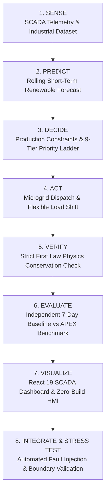
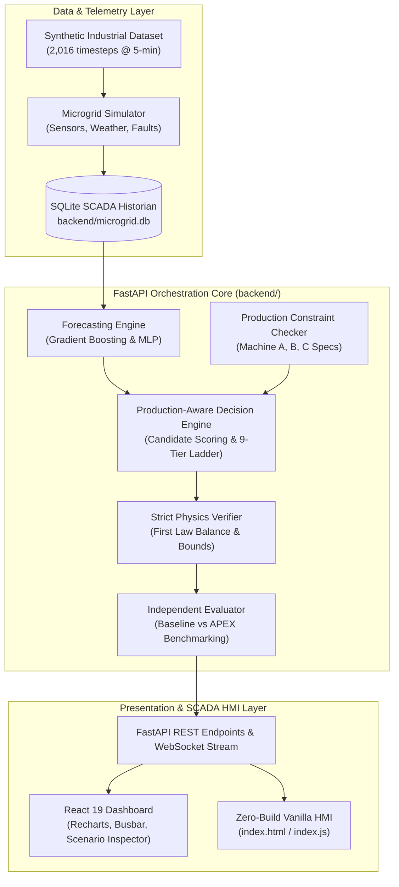

# APEX-Energy

### Production-Aware Autonomous Energy Orchestration Platform
**Hackathon Problem: SU-01 — Renewable Energy + Industrial Load Optimization**  
*From Production Context to Intelligent Energy Action*

---

> [!IMPORTANT]
> **MVP Scope & Prototype Declaration**  
> APEX-Energy is a **simulation-based digital prototype** developed on a deterministic synthetic industrial dataset. It demonstrates how industrial production constraints can be unified with renewable generation forecasting, battery storage, and microgrid dispatch. It is **not** an operational factory deployment, does not actuate physical industrial PLCs, and does not claim guaranteed financial returns.

---

## 1. Problem Statement & Architecture Gap

Industrial microgrids typically combine variable on-site renewable generation (Solar PV and Wind Turbines), Battery Energy Storage Systems (BESS), utility grid interconnections under Time-of-Use (TOU) tariffs, and factory machinery.

In conventional industrial facilities, three critical systems operate in isolated silos:
1. **Production Scheduling (MES/ERP):** Plans manufacturing jobs based purely on customer deadlines, machine availability, and shift quotas—blind to real-time energy tariffs and weather conditions.
2. **Energy Monitoring & SCADA:** Logs electrical power flows, busbar voltages, and battery state-of-charge (SOC)—unaware of upcoming production deadlines or machine flexibility.
3. **Energy Management Systems (EMS):** Executes reactive microgrid dispatch (e.g., charging batteries whenever surplus solar exists)—unable to intelligently shift flexible machinery into peak renewable generation windows.

### The APEX-Energy Solution
APEX-Energy bridges this gap by introducing **Production-Aware Energy Orchestration**:
```text
Renewable Generation + Industrial Production Context + Battery Storage + Utility Grid + Tariffs
                                        ↓
                       Autonomous Production-Aware Orchestration
```
The platform dynamically schedules flexible industrial loads into predicted renewable-rich windows, respects machine deadlines and continuous operation constraints, operates battery storage within strict electrochemical safety envelopes, and mathematically verifies the First Law of Thermodynamics on every single timestep.

---

## 2. Core Closed-Loop Workflow

APEX-Energy operates as an autonomous closed loop across 8 operational stages:



| Stage | Subsystem | Functionality |
| :--- | :--- | :--- |
| **1. SENSE** | Telemetry Ingestion | Ingests 5-minute telemetry: Solar PV, Wind, Battery SOC, Grid Status, Tariffs, and Machine loads. |
| **2. PREDICT** | Short-Term Forecaster | 180-minute autoregressive ML forecast (Solar GB, Wind MLP) and surge window detection. |
| **3. DECIDE** | Production Decision Engine | Scores feasible candidate schedules for Machine C and arbitrates power flows via a 9-tier priority ladder. |
| **4. ACT** | Microgrid Dispatch | Routes real-time power flows: flexible load shifting, BESS charge/discharge, grid import/export, and curtailment. |
| **5. VERIFY** | Strict Physics Verifier | Mathematically verifies $\text{Supply} = \text{Demand}$ ($\le 0.001\text{ kW}$ tolerance) and physical safety bounds. |
| **6. EVALUATE** | Independent Evaluator | Quantifies cumulative cost, curtailment reduction, self-consumption boost, and CO₂ savings against baseline. |
| **7. VISUALIZE** | SCADA HMI Dashboard | Real-time React 19 / Recharts interactive dashboard and zero-build Vanilla JS HMI. |
| **8. STRESS TEST** | Automated Stress Suite | 76 unit/integration tests validating grid outages, sensor faults, boundary limits, and zero drift. |

---

## 3. System Architecture & End-to-End Data Flow



---

## 4. MVP Scope: Implemented vs. Future Deployment

| Capability | Status in MVP Prototype | Future Real-World Industrial Target |
| :--- | :---: | :--- |
| **Industrial Telemetry** | **Simulated** | Deterministic synthetic dataset (2,016 timesteps, 5-min intervals) | Live IoT gateway ingestion via OPC-UA / MQTT / Modbus TCP |
| **Weather & Generation** | **Simulated** | Solar PV physical model (irradiance + cell temp) and IEC 61400 wind curve | On-site pyranometer, anemometer, and external numerical weather APIs |
| **Renewable Forecasting** | **Implemented** | Gradient Boosting & MLP models with 180-min horizon and surge detection | Hybrid physics-ML models with real-time satellite imagery feeds |
| **Production Constraints** | **Implemented** | Formal validators for continuous, semi-flexible, and flexible batch machines | Bi-directional API connectors to commercial MES / ERP systems |
| **Load Scheduling** | **Implemented** | Dynamic 30-min candidate window generation and scoring for Machine C | Multi-machine MILP / rolling-horizon optimal solver |
| **Decision Hierarchy** | **Implemented** | Deterministic 9-tier priority ladder with transparent textual explanations | Real-time closed-loop Model Predictive Control (MPC) |
| **Energy Verification** | **Implemented** | Strict First Law conservation checker ($\text{Supply} = \text{Demand}$) | Automated substation relay interlocks and revenue-grade meter audit |
| **Microgrid Dispatch** | **Simulated** | Software dispatch of BESS, Grid import/export, and clean curtailment | Hardware-in-the-Loop (HIL) PLC actuation via Modbus registers |
| **Operator Interface** | **Implemented** | React 19 SCADA dashboard + Zero-build Vanilla HMI + Swagger REST APIs | Industrial multi-screen SCADA control room integration |

---

## 5. Machine Production Constraints & Scheduling

The factory profile models three distinct industrial machines with strict production quotas:

| Asset | Power Rating | Machine Class | Operating Window | Production Quota & Constraints |
| :--- | :---: | :---: | :---: | :--- |
| **Machine A** | $25.0\text{ kW}$ | **CRITICAL** | Continuous (00:00–24:00) | **Uninterruptible extruder/smelter.** Zero shutdown allowed during weekdays; must never be shed or shifted. |
| **Machine B** | $20.0\text{ kW}$ | **SEMI-FLEXIBLE** | Two 4-Hour Shifts | Batch CNC/oven. Runs Shift 1 (08:00–12:00) and Shift 2 (13:00–17:00). Mandatory 1-hour lunch standby (12:00–13:00). |
| **Machine C** | $35.0\text{ kW}$ | **FLEXIBLE** | Window: 08:00–17:00 | **Batch finishing.** Requires exactly 3.0 continuous hours (42.0 kWh quota). Hard deadline: **17:00**. Shiftable. |
| **Auxiliary Load** | $10.0\text{ kW}$ | **BASE LOAD** | Continuous (00:00–24:00) | Lighting, ventilation, server racks, and safety systems. |

### Dynamic Candidate Window Scoring for Machine C
Machine C is **not** hardcoded to a fixed time. The decision engine dynamically generates all valid 3-hour candidate execution windows starting every 30 minutes from 08:00 to 14:00 (e.g., `08:00–11:00`, `08:30–11:30`, ..., `14:00–17:00`).

Each candidate window is mathematically scored using forecast renewable generation and TOU tariffs:
$$\text{Score} = w_1 \cdot \text{RenewableCoverage} + w_2 \cdot \text{AvoidedGridCost} - w_3 \cdot \text{PeakTariffPenalty}$$

* **Morning Peak Solar:** Selects `09:00 — 12:00` (highest composite score).
* **Midday Solar Surge:** Selects `11:00 — 14:00` or `10:30 — 13:30`.
* **Afternoon Solar Surge:** Selects `13:00 — 16:00`.
* **Constraint Guarantee:** Candidate start times after 14:00 are rejected because runtime would violate the 17:00 deadline.

---

## 6. Decision Hierarchy (9-Tier Priority Ladder)

When allocating energy at each timestep, the decision engine enforces an explainable 9-tier priority structure:

```text
[Tier 1] Protect Critical Production (Machine A continuously powered; zero interruptions)
   ↓
[Tier 2] Satisfy Flexible Quotas (Machine B & C scheduled within permitted windows before deadlines)
   ↓
[Tier 3] Prefer Direct Renewable Consumption (Solar & Wind directly routed to active factory loads)
   ↓
[Tier 4] Shift Flexible Load (Machine C aligned with forecast renewable surge windows)
   ↓
[Tier 5] Absorb Surplus into BESS (Charge battery up to 50 kW if SOC < 95%)
   ↓
[Tier 6] Discharge BESS during Deficits (Discharge battery up to 60 kW if SOC > 20% to avoid grid import)
   ↓
[Tier 7] Import from Utility Grid (Import remaining energy to guarantee continuous factory operation)
   ↓
[Tier 8] Export Surplus to Grid (Export clean power under feed-in tariff up to 50 kW export limit)
   ↓
[Tier 9] Inverter Curtailment (Curtail ONLY when factory, BESS, and Grid Export are fully saturated)
```

---

## 7. Short-Term Renewable Forecasting (Phase 2)

* **Models:** `GradientBoostingRegressor` (Solar PV) and `MLPRegressor` (Wind Turbine).
* **Validation Strategy:** Chronological 80% train / 20% test split. Past lag features (`solar_lag_1`, `solar_lag_2`, `solar_lag_12`, ambient temperature, irradiance, cloud cover, and diurnal cyclical sine/cosine encoders). **Zero future data leakage.**
* **Horizon:** 180 minutes (36 timesteps @ 5-minute resolution).
* **Surge Window Detection:** Scans the rolling predicted horizon for contiguous sequences where solar generation exceeds the $50.0\text{ kW}$ threshold, classifying prime opportunities for flexible load shifting.

> [!NOTE]
> Forecasting models were trained and validated on the project's synthetic dataset. Real-world deployment will require site-specific training against physical pyranometer and meteorological station telemetry.

---

## 8. Battery Energy Storage System (BESS)

Configured BESS technical parameters:

| Parameter | Configured Value | Operational Purpose |
| :--- | :---: | :--- |
| **Nominal Capacity** | $200.0\text{ kWh}$ | Total nameplate electrochemical energy capacity |
| **Safe Operating Envelope** | $[20.0\%, 95.0\%]$ | Prevents deep discharge degradation and overcharge hazards |
| **Max Charge Rate** | $50.0\text{ kW}$ | Inverter and charge controller thermal limitation |
| **Max Discharge Rate** | $60.0\text{ kW}$ | Inverter continuous discharge rating |
| **One-Way Efficiencies** | $\eta_{\text{chg}} = 95\%, \eta_{\text{dis}} = 95\%$ | Realistic round-trip electrochemical conversion loss ($90.25\%$ round-trip) |
| **Simultaneous Action** | **Strictly Forbidden** | Physical inverter interlock: cannot charge and discharge simultaneously |
| **Grid Outage Behavior** | **Islanding Mode** | Grid disconnected; BESS + Solar supply critical factory demand up to limits |

---

## 9. Strict Energy Balance & Physics Verification (Phase 4)

To guarantee that AI decisions never violate the First Law of Thermodynamics, every timestep is subjected to an independent mathematical verification layer:

$$\sum \text{Supply} = \sum \text{Demand}$$
$$\text{Solar} + \text{Wind} + P_{\text{BESS,dis}} + P_{\text{grid,imp}} = P_{\text{factory,load}} + P_{\text{BESS,chg}} + P_{\text{grid,exp}} + P_{\text{curtailment}}$$

### Failure-Injection & Boundary Stress Tests:
* **Corrupted Grid Import (+10 kW):** Injected discrepancy is immediately caught (`Balance Error = 10.0000 kW`, `Status: FAIL`).
* **Negative Power Generation:** Input of $-50\text{ kW}$ solar is rejected with negative flow violation.
* **Overcharge Request ($SOC = 98\%$):** Charging blocked; surplus diverted to export/curtailment.
* **Deep Discharge Request ($SOC = 15\%$):** Discharge blocked; deficit covered by grid import.
* **Simultaneous Charge & Discharge:** Inverter conflict detected and rejected.
* **Mean Balance Error:** **$0.0000\text{ kW}$** across all 2,016 timesteps.

---

## 10. The 7-Day Synthetic Industrial Dataset (Phase 1)

The dataset is **programmatically generated** (`backend/generate_apex_dataset.py`, `seed=42`) spanning 7 full days at 5-minute resolution (**2,016 timesteps**):

| Day | Scenario Tag | Physical System Conditions | Validated Platform Behavior |
| :---: | :--- | :--- | :--- |
| **Mon** | `NORMAL_OPERATION` | Baseline solar and wind; standard industrial shift quotas | 100% production quota satisfied; zero balance errors. |
| **Tue** | `SOLAR_SURGE` | High midday solar ($98.4\text{ kW}$ peak); clear sky | Machine C shifted into solar surge window; saves $278.79 daily. |
| **Wed** | `FLEXIBLE_SHIFT_OPPORTUNITY` | Moderate solar + sustained wind generation | Clean self-consumption optimized; curtailment reduced to $0.00\text{ kWh}$. |
| **Thu** | `GRID_FALLBACK` | Overcast, rainy day (solar peaks at only $28.5\text{ kW}$) | Critical Machine A protected via grid fallback; BESS held at $20\%$ minimum SOC. |
| **Fri** | `UNAVOIDABLE_CURTAILMENT` | High solar + full BESS ($95\%$) + $50\text{ kW}$ grid export cap | Avoids $23.0\text{ kWh}$ solar waste; remaining unavoidable excess safely curtailed. |
| **Sat** | `WEEKEND_LIGHT` | Light production (Mach B & C idle, continuous base load) | Surplus generation stored in BESS; zero machine quota violations. |
| **Sun** | `GRID_OUTAGE_ISLANDING` | Utility grid outage from 14:00 to 16:00 (`grid_status=0`) | Zero grid import/export; factory powered in island mode via BESS + Solar. |

### Data Classification Discipline
* **Configured:** Physical equipment ratings (25 kW, 20 kW, 35 kW), BESS limits (200 kWh, 20–95%), TOU tariffs ($4.50 off-peak / $7.50 peak).
* **Generated:** Ambient temperature, cloud cover, solar irradiance, Weibull wind speeds, machine telemetry.
* **Calculated / Algorithmic:** Renewable generation, BESS SOC Coulomb counting, dispatch allocations, and cumulative KPIs.
* **Zero APEX Bias:** Baseline counterfactual energy flows are generated independently; APEX decisions are computed at runtime.

---

## 11. Verified KPI Benchmark: Baseline vs. APEX-Energy

The independent evaluation engine (`backend/evaluation.py`) simulated both the baseline counterfactual (uncoordinated fixed schedules and greedy dispatch) and the APEX-Energy platform across the identical 7-day environmental inputs:

| Key Performance Indicator (KPI) | Baseline Counterfactual | APEX-Energy Orchestration | Delta / Verified Improvement |
| :--- | :---: | :---: | :---: |
| **Total Electricity Cost** | $\$8,078.00$ | **$\$7,988.45$** | **$-\$89.55$ ($-1.11\%$ net cost savings)** |
| **Renewable Curtailment** | $420.79\text{ kWh}$ | **$397.01\text{ kWh}$** | **$-23.78\text{ kWh}$ ($-5.65\%$ waste avoided)** |
| **Renewable Self-Consumption** | $78.68\%$ | **$78.79\%$** | **$+0.11\%$ cleaner self-consumption** |
| **Grid Import Dependency** | $2,047.33\text{ kWh}$ | **$2,041.74\text{ kWh}$** | **$-5.59\text{ kWh}$ reduced utility draw** |
| **Avoided $\text{CO}_2$ Emissions** | $1,433.13\text{ kg}$ | **$1,429.22\text{ kg}$** | **$+3.91\text{ kg CO}_2$ emissions avoided** |
| **BESS Equivalent Full Cycles** | $2.11\text{ EFC}$ | **$2.12\text{ EFC}$** | **$+0.01\text{ EFC}$ (negligible battery wear)** |
| **Production Quota Compliance** | $100.0\%$ | **$100.0\%$** | **Zero constraint violations (2,016 timesteps)** |

*Benchmark results are evaluated on the 7-day synthetic industrial dataset ($0.70\text{ kg CO}_2/\text{kWh}$ grid emission factor). Not a guarantee of real-world savings.*

---

## 12. Operator Dashboards & Interfaces

The platform provides two operator interfaces:

### 1. Modern SCADA Dashboard (`frontend/src/components/ApexDashboard.jsx`)
Built with **React 19**, **Vite 8**, **Tailwind CSS**, and **Recharts**:
* **Live Energy Overview:** 8 real-time KPI cards (Solar, Wind, Total Renewable, Load, SOC, Import, Export, Curtailment).
* **Animated Energy Flow Busbar:** Sankey-style power flow routing between renewables, factory loads, battery storage, and utility grid with dynamic particle animations.
* **7-Day Scenario Switcher:** One-click inspection of all 7 hackathon scenarios with multi-curve Recharts trajectories.
* **Production Status Panel:** Live machine telemetry, shift status, and quota progress indicators.
* **Transparent Decision Reasoning:** Algorithmic justification generated by the decision engine explaining *why* actions were taken.
* **Strict Physics Verification Panel:** Live energy balance error readout ($0.000\text{ kW}$) and 8-point physical constraint checklist.

### 2. Zero-Build Vanilla HMI (`index.html`, `index.js`, `index.css`)
* A lightweight zero-build browser client documented in `docs/APEX_Microgrid_SCADA_EMS_Detailed_System_Report.md`.
* Can be opened directly in any web browser without Node.js or `npm run dev` to monitor live WebSockets and REST APIs.

---

## 13. REST & WebSocket API Reference

The backend exposes a structured API built on **FastAPI**:

| Endpoint | Method | Purpose |
| :--- | :---: | :--- |
| `/api/status` | `GET` | SCADA server health, simulation state, and database connection status. |
| `/api/forecast/renewable` | `GET` | 180-minute rolling solar & wind forecast predictions and surge window detection. |
| `/api/decision/evaluate` | `GET` | Evaluates real-time 9-tier priority dispatch, machine constraints, and reasoning. |
| `/api/decision/candidates` | `GET` | Returns scored candidate operating windows for flexible Machine C. |
| `/api/verification/verify` | `POST` | Single-step First Law of Energy Conservation balance verifier. |
| `/api/verification/dataset` | `GET` | Full 2,016-step dataset verification certification report. |
| `/api/verification/status` | `GET` | Physics verification of live telemetry state. |
| `/api/evaluation/compare` | `GET` | Comprehensive 7-day Baseline vs APEX cumulative benchmark and daily breakdown. |
| `/api/evaluation/kpis` | `GET` | Summary KPI cards for frontend dashboard presentation. |
| `/api/scenario/details` | `GET` | 24-hour trajectories (48 sampled points @ 30-min), tags, and decisions for days 0–6. |
| `/ws` | `WS` | Real-time bi-directional SCADA telemetry stream. |

Interactive API documentation is accessible at `http://localhost:8000/docs` (Swagger UI) and `http://localhost:8000/redoc`.

---

## 14. Repository Structure

```text
APEX-Energy/
├── backend/                                  # FastAPI & Algorithmic Core
│   ├── main.py                               # REST API & WebSocket server
│   ├── decision_engine.py                    # Production constraints & 9-tier decision engine
│   ├── forecasting.py                        # Gradient Boosting & MLP forecasting engine
│   ├── verification.py                       # Strict First Law physics verifier
│   ├── evaluation.py                         # Independent 7-day Baseline vs APEX evaluator
│   ├── generate_apex_dataset.py              # Programmatic 2,016-step industrial dataset generator
│   ├── database.py                           # SQLite SCADA historian manager
│   ├── simulator.py                          # Telemetry simulation engine
│   ├── ems.py                                # Supervisory dispatch loop
│   ├── protocols.py                          # Modbus TCP, CAN Bus, IEC 61850 protocol codecs
│   ├── ai_models.py                          # Predictive maintenance telemetry models
│   ├── benchmark_performance.py              # Phase 7 empirical benchmarking script
│   ├── plot_forecast_validation.py           # Forecast validation chart generator
│   ├── phase7_validation_report.json         # Phase 7 empirical benchmark metrics
│   ├── microgrid.db                          # Authoritative pre-loaded SCADA historian DB (73k rows)
│   ├── requirements.txt                      # Python dependencies
│   ├── pyproject.toml                        # Project packaging metadata
│   ├── run_all_tests.py                      # Master regression test runner
│   └── test_*.py                             # 8 test suites (76 tests total)
├── frontend/                                 # Modern SCADA HMI Dashboard
│   ├── src/
│   │   ├── components/
│   │   │   └── ApexDashboard.jsx             # Comprehensive SCADA HMI dashboard component
│   │   ├── App.jsx                           # Application container & navigation
│   │   ├── main.jsx                          # React root mount
│   │   └── index.css                         # Tailwind CSS styling
│   ├── package.json                          # Frontend dependencies (React 19, Recharts, Lucide)
│   ├── vite.config.js                        # Vite 8 build configuration
│   └── tailwind.config.js                    # Tailwind styling configuration
├── sample_datasets/                          # Authoritative Benchmark Datasets
│   ├── apex_industrial_dataset.csv           # 2,016-row 7-day primary APEX dataset
│   ├── apex_machines_dataset.csv             # Machine-specific telemetry breakdown
│   ├── forecast_vs_actual.png                # Phase 2 ML forecast validation curve
│   └── *.csv                                 # Pre-loaded microgrid baseline datasets
├── docs/                                     # System Documentation & Reports
│   ├── architecture.md                       # Platform architectural specifications
│   ├── deployment.md                         # Production deployment guide
│   └── APEX_Microgrid_SCADA_EMS_...md        # Detailed technical system report
├── index.html                                # Zero-build Vanilla HMI dashboard entry point
├── index.js                                  # Zero-build Vanilla HMI controller
├── index.css                                 # Zero-build Vanilla HMI stylesheet
├── system_architecture.png                   # System architecture visual diagram
├── APEX_Microgrid_SCADA_EMS_...Final.docx    # Final Word evaluation report artifact
├── .gitignore                                # Git ignore rules (protects backend/microgrid.db)
└── README.md                                 # This file
```

---

## 15. Database Configuration

The authoritative database is **`backend/microgrid.db`** (19.15 MB), containing over 73,000 SCADA historian records and 4,900 alarm journal entries.

* **Path Resolution:** Database access in `backend/database.py` is anchored to its parent directory:
  ```python
  DB_FILE = os.environ.get("APEX_DB_FILE") or os.path.join(os.path.dirname(os.path.abspath(__file__)), "microgrid.db")
  ```
* **Environment Override:** You can point to an alternative database file using the `APEX_DB_FILE` environment variable.
* Whether launched from the project root or inside `backend/`, the application cleanly binds to `backend/microgrid.db`.

---

## 16. Installation & Setup

### Prerequisites
* **Python:** Version 3.11 or higher
* **Node.js:** Version 18 or higher (with `npm`)

### Step 1: Install Backend Dependencies
```powershell
cd backend
pip install -r requirements.txt
```

### Step 2: Install Frontend Dependencies
```powershell
cd ../frontend
npm install
```

---

## 17. Running the Complete System

### Terminal 1: Launch FastAPI Backend Server
```powershell
cd d:\KPR\scada\backend
python -m uvicorn main:app --host 0.0.0.0 --port 8000 --reload
```
*Backend will be active at:* `http://localhost:8000`  
*API Documentation (Swagger UI):* `http://localhost:8000/docs`

### Terminal 2: Launch React SCADA Dashboard
```powershell
cd d:\KPR\scada\frontend
npm run dev
```
*Dashboard will open at:* `http://localhost:5173`

### Alternative: Zero-Build Vanilla HMI
With the backend running, double-click [`index.html`](file:///d:/KPR/scada/index.html) in the project root to open the lightweight Vanilla HMI dashboard in any browser without Node.js.

---

## 18. Verification & Testing

The repository features automated regression, integration, and stress test suites:

### Run Backend Master Test Suite (76 Tests)
```powershell
python backend/run_all_tests.py
```
**Verified Result:**
```text
======================================================================
SUMMARY:
Total Tests Run: 76
Failures:       0
Errors:         0
Status:         SUCCESS / PASS
======================================================================
```

### Run Frontend Production Build
```powershell
cd frontend
npm run build
```
**Verified Result:** Built cleanly in 2.17s (`dist/index.html`, `dist/assets/index-BtX4Kn61.css`, `dist/assets/index-Bm9TjSJF.js`).

---

## 19. Engineering Principles

* **Explainability First:** Decisions provide transparent, human-readable justifications explaining why loads were shifted or how surplus energy was prioritized.
* **Physics Conservation First:** Energy allocations must strictly conserve energy. Any imbalance $>0.001\text{ kW}$ triggers an automatic verification failure.
* **Production Protection First:** Clean energy goals can never override critical machine requirements. Machine A is protected continuously, and Machine C deadlines are strictly enforced.
* **Fail-Safe Operation:** Invalid sensor data, corrupted telemetry, or battery limit breaches trigger safe fallback modes (e.g., microgrid islanding, grid import fallback, BESS cutoff).
* **Zero Circularity:** Baseline counterfactuals and APEX performance metrics are simulated independently from raw inputs without artificial mathematical coupling.
* **Deterministic Reproducibility:** Datasets, initial states, and random seeds are fixed (`seed=42`) to ensure 100% reproducible benchmarks.

---

## 20. Limitations & Future Roadmap

### Prototype Limitations
* **Synthetic Data:** Weather and industrial machine profiles are synthetic simulations, not physical factory sensors.
* **Simplified Machinery:** Models three machine archetypes (extruder, CNC oven, batch finishing) rather than a complex multi-stage assembly line.
* **Software-Only Actuation:** Dispatches energy via simulation models rather than physical PLC fieldbus signals.
* **Single Battery Topology:** Simulates a single 200 kWh battery rather than multi-string heterogeneous BMS racks.

### Future Industrial Roadmap
```text
Current Digital MVP
        ↓
Phase 8: Hardware-in-the-Loop (HIL) PLC Simulation (OPC-UA / Modbus TCP / MQTT)
        ↓
Phase 9: Real-World Weather Station & External TOU Tariff API Ingestion
        ↓
Phase 10: Multi-Machine Mixed-Integer Linear Programming (MILP) Optimization Engine
        ↓
Phase 11: Real BMS Hardware Integration & Thermal Runaway Safety Relays
        ↓
Phase 12: Pilot Deployment in Light Manufacturing Facility
```

---

## License & Hackathon Attribution

* **Project:** APEX-Energy — Production-Aware Autonomous Energy Orchestration Platform
* **Track / Problem:** SU-01 — Renewable Energy + Industrial Load Optimization
* Developed as an open-source technical prototype demonstrating production-aware energy orchestration.
