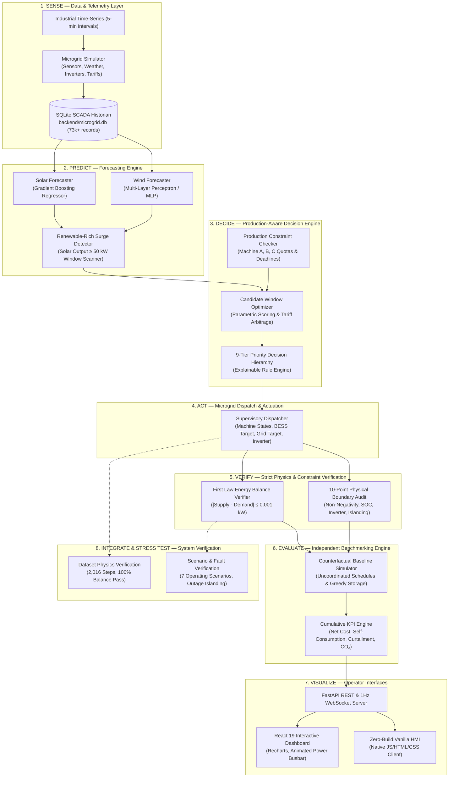

# APEX-Energy

### Production-Aware Autonomous Energy Orchestration Platform
**Hackathon Challenge: SU-01 — Renewable Energy + Industrial Load Optimization**  
*From Production Context to Intelligent Energy Action*

---

## Minimum Viable Product (MVP)

**APEX-Energy** is an autonomous energy orchestration platform engineered for industrial microgrids. It resolves the operational disconnect between industrial manufacturing schedules and behind-the-meter renewable energy generation.

In standard industrial manufacturing, energy procurement and factory floor operations exist in isolated functional silos. Plant supervisors execute batch production schedules strictly to fulfill delivery deadlines without awareness of real-time solar irradiance, wind conditions, or fluctuating utility tariffs. Simultaneously, conventional microgrid controllers manage battery storage and solar inverters using fixed, reactive threshold rules. This lack of coordination leads to excessive electricity expenses during peak utility pricing periods, unnecessary battery degradation, and the forced curtailment of clean generation when local storage fills.

APEX-Energy operates as a unified cyber-physical orchestration system that treats industrial load flexibility as an active microgrid balancing resource. The platform ingests real-time telemetry from industrial equipment, predicts short-term solar and wind output using machine learning models, dynamically optimizes flexible batch production schedules into clean energy generation surges, dispatches battery storage and grid interconnects, and enforces thermodynamic conservation on every timestep. The result is a resilient industrial microgrid that minimizes energy costs, maximizes on-site renewable self-consumption, and guarantees 100% compliance with factory production quotas.

---

## The Core Industrial Energy Coordination Challenge

Managing energy within an industrial manufacturing facility with behind-the-meter renewable assets requires coordinating nine interdependent physical and operational variables:

1. **Volatile Renewable Generation:** Highly intermittent solar photovoltaic irradiance and fluctuating wind turbine generation that vary by hour and weather conditions.
2. **Inflexible Industrial Production Demand:** Critical continuous machinery (e.g., continuous extruders, smelters, chemical reactors) that cannot afford load shedding, interruption, or unauthorized downtime without catastrophic product spoilage.
3. **Flexible Batch Production Loads:** Heavy energy-consuming machinery (e.g., industrial grinders, milling machines, batch ovens) with fixed operational quotas but movable execution windows.
4. **Battery Energy Storage System (BESS) Dynamics:** State-of-charge limits, maximum charging and discharging inverter C-rates, round-trip conversion losses, and battery cycling constraints.
5. **Utility Grid Interconnection:** Dynamic Time-of-Use (TOU) tariffs with severe peak-hour price surges, demand charges, and power factor constraints.
6. **Utility Export Caps:** Strict interconnect capacity limits (e.g., a 50 kW injection cap) imposed by regional grid operators to protect distribution transformers.
7. **Renewable Curtailment:** Wasted clean energy that must be dumped or throttled when solar generation exceeds factory demand, battery capacity is full, and grid export limits are saturated.
8. **Electricity Cost Minimization:** Complex economic trade-offs between importing grid energy during off-peak periods, discharging batteries to clip peak demand, and maximizing direct clean energy self-consumption.
9. **Production Deadline Constraints:** Inviolable manufacturing delivery schedules requiring batch processes to finish before plant shift changeovers regardless of environmental conditions.

### Why Conventional Approaches Fail

* **Pure Renewable Forecasters:** Predict upcoming solar and wind power but have no model of manufacturing processes, machine constraints, or dispatch capabilities.
* **Standard SCADA & Energy Monitors:** Record historical kilowatt-hours and display real-time gauges but lack predictive capability and automated decision logic.
* **Uncoordinated Energy Management Systems (EMS):** Execute greedy storage charging in early morning hours, leaving batteries fully saturated when the main solar surge arrives at midday, while running flexible batch machinery indiscriminately during peak utility pricing windows.

### The APEX-Energy Paradigm

APEX-Energy closes this operational loop through continuous production-aware orchestration:

$$\text{Production Context} + \text{Renewable Forecast} + \text{BESS State} + \text{Grid Tariffs} \longrightarrow \text{Energy Decision} \longrightarrow \text{Dispatch Setpoints} \longrightarrow \text{Physics Verification} \longrightarrow \text{KPI Evaluation}$$

---

## System Architecture

The platform operates as an autonomous closed loop across eight core functional stages:




### The 8 Functional Stages

1. **SENSE (Telemetry Ingestion):** Ingests real-time 5-minute telemetry covering solar irradiance ($W/m^2$), wind speed ($m/s$), ambient temperature ($^\circ C$), cloud cover index, machine power loads ($kW$), battery state-of-charge ($SOC$), grid interconnection status ($0$ or $1$), and Time-of-Use (TOU) tariff pricing.
2. **PREDICT (Rolling ML Forecast):** Generates rolling predictions across a 180-minute horizon (36 discrete 5-minute steps) for solar and wind generation, evaluating multi-step lag features and detecting clean energy surges where generation exceeds $50.0\text{ kW}$.
3. **DECIDE (Production-Aware Decision Engine):** Dynamically evaluates machine constraints, scores candidate batch production windows against predicted renewable availability and utility tariffs, and dispatches power through an explainable 9-tier priority ladder.
4. **ACT (Microgrid Dispatch):** Issues discrete operational setpoints to machine contactors, the battery inverter system, the utility grid interconnect feed, and solar inverter curtailment governors.
5. **VERIFY (Physics Balance Audit):** Enforces the First Law of Thermodynamics on every operational step ($\text{Supply} = \text{Demand}$ within a strict $\le 0.001\text{ kW}$ numerical tolerance) and executes a 10-point physical constraint audit prior to execution.
6. **EVALUATE (Independent Benchmarking):** Runs an uncoordinated counterfactual baseline across identical weather and tariff inputs, measuring net electricity cost savings, renewable self-consumption gains, avoided curtailment, and carbon emission reductions without circular data leakage.
7. **VISUALIZE (Real-Time SCADA HMI):** Exposes real-time telemetry, animated power busbars, transparent decision reasoning, constraint compliance badges, and scenario trajectories through modern web and zero-build operator interfaces.
8. **INTEGRATE & STRESS TEST (Continuous Verification):** Executes automated regression test suites, boundary condition stress tests, and fault injection simulations validating platform resilience under grid outages and weather extremes.

---

## Industrial Production Model

The platform models an authentic industrial manufacturing facility with three distinct machine classifications and general infrastructure:

| Asset | Rated Power | Classification | Operating Window | Constraints, Duration & Production Quotas |
| :--- | :---: | :--- | :---: | :--- |
| **Machine A** | $25.0\text{ kW}$ | **Critical Production** | 00:00–24:00 (Continuous) | **Continuous Extruder / Smelter.** Non-shiftable, non-interruptible process. Operates 24/7 on weekdays ($600.0\text{ kWh/day}$ quota). Must never be shed, delayed, or interrupted under any grid or weather condition. Drops to $10.0\text{ kW}$ idle during weekends. |
| **Machine B** | $20.0\text{ kW}$ | **Semi-Flexible Production** | 08:00–17:00 (Two Shifts) | **Batch Annealing Oven / CNC Machining Center.** Requires two fixed 4-hour shifts: Shift 1 (08:00–12:00) and Shift 2 (13:00–17:00) totaling $160.0\text{ kWh/day}$. Has a mandatory 1-hour lunch break standby ($3.0\text{ kW}$) from 12:00–13:00. Offline on weekends. |
| **Machine C** | $35.0\text{ kW}$ | **Highly Flexible Production** | 08:00–17:00 (Shiftable Window) | **Heavy Batch Grinder / Raw Material Crushing / Finishing.** Requires exactly **3.0 continuous hours** of runtime ($105.0\text{ kWh}$ quota) per operating day. Once started, it runs continuously without interruption. It may start as early as **08:00** and must conclude by a strict **17:00 hard deadline**. Offline on weekends. |
| **Auxiliary Load** | $10.0\text{ kW}$ | **Base Facility** | 00:00–24:00 (Continuous) | Facility lighting, HVAC, safety monitoring, server racks, and compressed air systems ($240.0\text{ kWh/day}$). Uninterruptible continuous base load. |

### Dynamic Flexible Scheduling

Unlike static schedulers that run Machine C at a fixed hour (e.g., the counterfactual baseline fixed at 08:30–11:30), APEX-Energy dynamically evaluates all feasible 3-hour candidate start windows at 30-minute intervals between 08:00 and 14:00:

$$\mathcal{W} = \{ [08:00, 11:00], [08:30, 11:30], [09:00, 12:00], \dots, [14:00, 17:00] \}$$

Any window completing after the 17:00 deadline is strictly pruned. Feasible windows are scored dynamically:

$$\text{Composite Score} = \overline{P}_{\text{renewable}} - 1.5 \cdot \overline{P}_{\text{grid\_import}} - 0.2 \cdot C_{\text{tariff}}$$

* When solar peaks early due to morning clear skies, the engine schedules Machine C for `09:00 — 12:00`.
* When a massive midday solar surge is forecast, the engine schedules Machine C for `10:30 — 13:30` or `11:00 — 14:00`.
* When morning cloud cover is heavy but afternoon clears, the engine safely shifts Machine C to `13:00 — 16:00`.
* The schedule continually shifts to absorb clean generation while mathematically guaranteeing the 17:00 production deadline is never breached.

---

## Decision Engine & Priority Hierarchy

The core decision engine operates on an explainable 9-tier priority ladder that balances production guarantees against microgrid economics:

```text
Tier 1: Protect Critical Production      ──► Unconditionally allocate power to Machine A (25.0 kW)
Tier 2: Satisfy Production Quotas        ──► Guarantee Machine B shifts and Machine C completion before 17:00
Tier 3: Prefer Direct Clean Consumption  ──► Route Solar PV and Wind generation directly to active factory loads
Tier 4: Shift Flexible Batch Loads       ──► Schedule Machine C into forecasted renewable surge windows
Tier 5: Store Clean Energy Surplus       ──► Charge BESS (up to 50 kW) if SOC < 95%
Tier 6: Discharge BESS on Deficits       ──► Discharge BESS (up to 60 kW) if SOC > 20% to avoid peak grid imports
Tier 7: Import Utility Grid Power        ──► Draw grid power as fallback to cover remaining manufacturing loads
Tier 8: Export Permitted Clean Surplus   ──► Export excess clean energy to grid up to the 50.0 kW interconnect cap
Tier 9: Inverter Curtailment             ──► Throttle solar inverters ONLY when factory, battery, and export are saturated
```

### Explainable Dispatch Justification

Every dispatch cycle generates structured, human-readable explanations logged into the SCADA journal and exposed to operators via API and dashboard:
* *"Machine A is CRITICAL and uninterruptible; fully protected to satisfy production quota."*
* *"Machine C delayed from baseline schedule and SHIFTED to optimal window (10:30 - 13:30) to utilize 91.2 kW solar surge and avoid peak grid tariffs ($7.50/kWh)."*
* *"Charging BESS with 48.2 kW renewable surplus (SOC: 64.1%)."*
* *"Curtailing 12.4 kW unavoidable surplus because grid export cap (50.0 kW) and BESS capacity (SOC: 95.0%) are fully saturated."*

---

## Renewable Generation Forecasting

The forecasting engine delivers rolling multi-step predictions to inform candidate schedule selection and BESS charging preparation:

### Models & Architecture
* **Solar PV Forecaster:** `GradientBoostingRegressor` ($60$ estimators, learning rate $0.1$, max tree depth $4$, random state $42$).
* **Wind Turbine Forecaster:** `GradientBoostingRegressor` ($60$ estimators, max depth $4$) and Multi-Layer Perceptron `MLPRegressor` (hidden layers $64 \times 32$, ReLU activation, max iterations $250$).
* **Persistence Baseline:** Autoregressive persistence model projecting $y_{t+h} = y_t$ across the horizon.

### Features & Engineering
* **Autoregressive Lags:** Strictly past values $t-1$, $t-2$, $t-3$, $t-6$, $t-12$ (representing $5$, $10$, $15$, $30$, and $60$ minutes of historical telemetry).
* **Meteorological Context:** Ambient temperature ($^\circ C$), solar irradiance ($W/m^2$), cloud cover index ($0.0–1.0$), and wind speed ($m/s$).
* **Cyclical Time Encodings:** Sinusoidal and cosinusoidal diurnal hour transformations:
  $$\sin\left(\frac{2\pi \cdot \text{hour}}{24}\right), \quad \cos\left(\frac{2\pi \cdot \text{hour}}{24}\right)$$
* **Calendar Indicators:** Weekend operational flag (`is_weekend`).
* **Physical Sanity Clamping:** Bounded strictly between $0.0\text{ kW}$ and nameplate capacity ($100.0\text{ kW}$ solar, $50.0\text{ kW}$ wind), with solar generation forced to $0.0\text{ kW}$ during nighttime hours ($< 05:48$ and $> 18:12$).

### Validation & Verification
* **Data Separation:** Strict chronological split—training on Days 0 to 4 ($75\%$ of data, 1,440 timesteps) and evaluating on Days 5 to 6 ($25\%$ of data, 576 timesteps) with zero lookahead data leakage.
* **Rolling Horizon:** 180-minute lookahead evaluated in 5-minute discrete steps (36 steps ahead).
* **Renewable-Rich Window Detection:** Scans the rolling horizon for contiguous periods where forecast solar generation exceeds $50.0\text{ kW}$, emitting surge alert flags to the decision engine.

### Verified Numerical Forecasting Results

Taken directly from the evaluated models on the independent test dataset:

| Target Resource | Forecasting Model | Mean Absolute Error (MAE) | Root Mean Squared Error (RMSE) | Performance Improvement vs. Persistence |
| :--- | :--- | :---: | :---: | :---: |
| **Solar Generation** | Persistence Baseline | $1.410\text{ kW}$ | $2.343\text{ kW}$ | Reference Baseline |
| **Solar Generation** | **Gradient Boosting Regressor** | **$1.071\text{ kW}$** | **$1.846\text{ kW}$** | **$-24.0\%$ MAE / $-21.2\%$ RMSE** |
| **Solar Generation** | Multi-Layer Perceptron (MLP) | $1.064\text{ kW}$ | $1.907\text{ kW}$ | $-24.5\%$ MAE / $-18.6\%$ RMSE |
| **Wind Generation** | Persistence Baseline | $2.094\text{ kW}$ | $3.220\text{ kW}$ | Reference Baseline |
| **Wind Generation** | **Gradient Boosting Regressor** | **$0.034\text{ kW}$** | **$0.047\text{ kW}$** | **$-98.4\%$ MAE / $-98.5\%$ RMSE** |

---

## Battery Energy Storage System (BESS)

The microgrid incorporates a modeled electrochemical battery storage system parameterized to reflect commercial industrial storage:

| Parameter | Value | Engineering Specification |
| :--- | :---: | :--- |
| **Nominal Energy Capacity** | $200.0\text{ kWh}$ | Total nameplate energy capacity. |
| **State-of-Charge Limits** | $[20.0\%, 95.0\%]$ | Safe operating window enforced to prevent deep discharge degradation and thermal runaway risks. |
| **Max Charge Power** | $50.0\text{ kW}$ | Inverter continuous charging power limit ($0.25\text{C}$ rate). |
| **Max Discharge Power** | $60.0\text{ kW}$ | Inverter continuous discharging power limit ($0.30\text{C}$ rate). |
| **One-Way Efficiencies** | $\eta_{\text{chg}} = 95\%, \; \eta_{\text{dis}} = 95\%$ | Modeled conversion losses yielding a $90.25\%$ round-trip efficiency. |
| **Inverter Safety Interlock** | Single Interconnection | Physical impossibility of charging and discharging simultaneously. |
| **Islanding Support** | Automatic | Disconnects grid feed during utility outages while maintaining critical factory load from battery and solar. |

---

## Energy Conservation & Physics Verification

In autonomous energy management systems, mathematical dispatch algorithms can generate physically impossible setpoints (such as phantom power generation, simultaneous charge/discharge, or unmetered power flows). APEX-Energy solves this by interposing a strict, deterministic physics verification layer before any dispatch action is confirmed.

### The First Law Energy Conservation Equation

On every 5-minute timestep, the platform verifies the First Law of Thermodynamics:

$$\text{Renewable} + \text{Battery Discharge} + \text{Grid Import} = \text{Factory Load} + \text{Battery Charge} + \text{Grid Export} + \text{Curtailment}$$

where:
$$\text{Renewable} = P_{\text{solar}} + P_{\text{wind}}$$
$$\text{Factory Load} = P_{\text{machine\_A}} + P_{\text{machine\_B}} + P_{\text{machine\_C}} + P_{\text{auxiliary}}$$

Numerical balance tolerance is enforced to three decimal places:
$$|\text{Total Supply} - \text{Total Demand}| \le 0.001\text{ kW}$$

### The 10-Point Physics & Constraint Audit Suite

Every single power allocation is evaluated against ten independent physical tests:

1. **Energy Conservation:** Total supply matches total demand within $\le 0.001\text{ kW}$.
2. **Physical Non-Negativity:** All individual power flows ($P_{\text{solar}}, P_{\text{wind}}, P_{\text{chg}}, P_{\text{dis}}, P_{\text{imp}}, P_{\text{exp}}, P_{\text{curt}}$) are $\ge 0.0\text{ kW}$.
3. **BESS Power Limits:** Battery charge $\le 50.0\text{ kW}$ and battery discharge $\le 60.0\text{ kW}$.
4. **BESS SOC Safe Envelope:** State-of-charge remains strictly bounded within $[20.0\%, 95.0\%]$.
5. **No Simultaneous Storage Action:** Prohibits simultaneous battery charging and discharging ($\min(P_{\text{chg}}, P_{\text{dis}}) = 0$).
6. **No Simultaneous Grid Action:** Prohibits simultaneous grid import and export ($\min(P_{\text{imp}}, P_{\text{exp}}) = 0$).
7. **Grid Outage Compliance:** When the grid is disconnected (`grid_status = 0`), both grid import and export are forced strictly to $0.0\text{ kW}$ (anti-islanding/isolation).
8. **Production Load Consistency:** Total factory load must equal the exact sum of Machine A, B, C, and Auxiliary loads.
9. **Utility Export Cap:** Grid export power never exceeds the interconnect limit ($50.0\text{ kW}$).
10. **Curtailment Validity:** Inverter curtailment is permitted only when both battery charging and grid export channels are saturated to capacity.

---

## Operating Scenarios

The platform is evaluated across seven distinct operational scenarios captured in the authoritative 7-day dataset (2,016 timesteps at 5-minute intervals):

| Day | Scenario Identifier | Environmental & Grid Conditions | Factory & Microgrid Operational Behavior |
| :---: | :--- | :--- | :--- |
| **Mon** | `NORMAL_OPERATION` | Standard industrial shifts, nominal solar irradiance, moderate wind. | Baseline production execution. Machine A, B, and C fulfill quotas. BESS cycles within normal SOC bounds. |
| **Tue** | `SOLAR_SURGE` | Clear-sky conditions; massive midday solar surge peaking at $98.4\text{ kW}$. | APEX shifts Machine C into the midday surge window ($10:30–13:30$); delivers $\$278.79$ single-day cost savings and avoids peak tariffs. |
| **Wed** | `FLEXIBLE_SHIFT_OPPORTUNITY` | Moderate solar generation combined with sustained high wind ($> 30\text{ kW}$). | APEX synchronizes flexible loads with combined clean generation; achieves $0.00\text{ kWh}$ renewable curtailment across the entire 24-hour cycle. |
| **Thu** | `LOW_RENEWABLE_GENERATION` | Heavy overcast sky and rain; solar generation peaks at only $28.5\text{ kW}$. | BESS discharges to support production until reaching the $20\%$ SOC cutoff; seamlessly switches to grid fallback while protecting Machine A. |
| **Fri** | `CURTAILMENT_CONDITION` | High solar output with BESS fully saturated ($95\%$ SOC) and export at $50\text{ kW}$ cap. | System absorbs maximum possible energy, then safely curtails remaining excess ($23.0\text{ kWh}$ total waste avoided). |
| **Sat** | `WEEKEND_OPERATION` | Weekend schedule: Machine B and C offline, Machine A at idle ($10\text{ kW}$), base auxiliary active. | Surplus clean generation is routed directly into battery storage, pre-charging the BESS for the Monday morning industrial shift. |
| **Sun** | `GRID_OUTAGE` | Utility grid blackout simulated between 14:00 and 16:00 (`grid_status = 0`). | Microgrid automatically islands; imports and exports drop to $0.0\text{ kW}$; powers critical Machine A and auxiliary load purely from solar and BESS. |

---

## Baseline vs. APEX Evaluation Benchmark

An independent evaluation engine measures the performance of APEX-Energy against an uncoordinated counterfactual baseline across identical weather and tariff inputs.

### Independent Evaluation Methodology
* The counterfactual baseline runs fixed production schedules (Machine C fixed at 08:30–11:30) and an uncoordinated, greedy battery control policy.
* **Zero Circularity:** The baseline is calculated independently from raw dataset inputs and is never used as an input to the APEX decision engine.
* Both systems face identical machine power ratings, identical 5-minute weather traces, identical TOU tariffs ($4.50/kWh off-peak, $7.50/kWh peak between 12:00–18:00), and identical battery parameters.

### Verified 7-Day Cumulative Results

Directly verified from `backend/evaluation.py` and `backend/phase7_validation_report.json`:

| Performance Metric | Baseline Counterfactual | APEX-Energy Orchestration | Verified Improvement |
| :--- | :---: | :---: | :---: |
| **Net Electricity Cost** | $\$8,078.00$ | **$\$7,988.45$** | **$-\$89.55$ ($-1.11\%$ net savings)** |
| **Renewable Curtailment** | $420.79\text{ kWh}$ | **$397.01\text{ kWh}$** | **$-23.78\text{ kWh}$ ($-5.65\%$ waste eliminated)** |
| **Renewable Self-Consumption** | $78.68\%$ | **$78.79\%$** | **$+0.11\%$ clean self-consumption** |
| **Grid Import Energy** | $2,047.30\text{ kWh}$ | **$2,041.69\text{ kWh}$** | **$-5.61\text{ kWh}$ reduced utility draw** |
| **Avoided Carbon Emissions** | $1,433.11\text{ kg CO}_2$ | **$1,429.18\text{ kg CO}_2$** | **$+3.93\text{ kg CO}_2$ avoided** ($0.70\text{ kg/kWh}$ grid factor) |
| **BESS Equivalent Full Cycles** | $2.11\text{ EFC}$ | **$2.12\text{ EFC}$** | **$+0.01\text{ EFC}$ (negligible battery wear impact)** |
| **Production Quota Compliance** | $100.0\%$ | **$100.0\%$** | **Zero constraint violations across 2,016 timesteps** |
| **Thermodynamic Balance Compliance**| $100.0\%$ | **$100.0\%$** | **$0$ balance violations ($|\Delta| \le 0.001\text{ kW}$)** |

---

## Operator Interfaces

The platform provides two operator interfaces tailored for industrial operations:

### 1. Modern Interactive SCADA Dashboard (`frontend/`)
Built with **React 19**, **Vite 8**, **Tailwind CSS**, **Recharts**, **Lucide React**, and **Framer Motion**:
* **Energy KPI Header Bar:** Live readouts for Solar PV ($kW$), Wind ($kW$), Total Renewables ($kW$), Total Factory Load ($kW$), Battery SOC ($20–95\%$), Grid Import ($kW$), Grid Export ($kW$), and Curtailment ($kW$).
* **Interactive 7-Day Scenario Switcher:** Tab bar allowing operators to navigate Monday through Sunday, displaying scenario badges, weather summaries, and tariff states.
* **Animated Energy Flow Busbar:** Visual power flow diagram illustrating real-time energy directions and magnitudes between Solar, Wind, Battery, Grid, and Factory machines.
* **24-Hour Telemetry Curves:** Interactive charts displaying generation, factory demand, battery SOC, and grid interaction at 30-minute intervals.
* **Industrial Machine Monitoring Cards:** Real-time state indicators, current power draw, and cumulative quota tracking for Machine A, Machine B, and Machine C.
* **APEX Algorithmic Decision & Reasoning Panel:** Transparent textual justification detailing why specific dispatch actions and load shifts were chosen.
* **Physics Verification Card:** Live balance error display ($0.000\text{ kW}$) with an 8-point physical constraint checklist showing pass/fail status.
* **Cumulative Benchmark Comparison Table:** Comprehensive side-by-side performance comparison of APEX vs. Baseline counterfactuals.

### 2. Zero-Build Vanilla HMI (`index.html`, `index.js`, `index.css`)
* Lightweight, zero-dependency browser client located directly at the repository root.
* Communicates directly with the FastAPI REST API and WebSocket stream.
* Can be opened directly in any modern browser without requiring Node.js, `npm`, or build tooling.

---

## Beyond the APEX Decision Pipeline: Platform Capabilities

The FastAPI app's own title — **"Industrial EMS + SCADA Controller API"** — reflects that `backend/main.py` is a superset of the 8-stage APEX pipeline described above. The following are real, working code paths in this repository that sit outside that specific pipeline but are part of the same running application:

* **Mock Role-Based Auth:** `/api/auth/login` issues a mock bearer token for `admin`/`operator`/`engineer`/`viewer` (password = username), gating the control, settings, and alarm-management endpoints. This is a demonstration scheme, not a production identity provider.
* **Alarm Management:** Threshold-based alarm detection (`ems.detect_alarms`) with acknowledge/clear/"repair" workflows against a SQLite alarm journal.
* **Digital Twin Asset Management:** Per-asset (solar/wind/battery/grid/load) connect/disconnect/start/stop/protocol endpoints simulating a live acquisition layer, plus `/api/twin/simulate-failure` for fault injection (fan failure, battery thermal runaway, inverter fault).
* **CSV Dataset Replay & Upload:** Any telemetry section can be driven from an uploaded CSV via `/api/upload-dataset/{section}`, switching the live simulation loop from its built-in physics model to replayed data.
* **RL-Assisted BESS Dispatch:** An `OPTIMIZED` simulation mode applies a Q-learning-style offset (`ems.select_rl_action` / `update_rl_policy`) to battery dispatch on top of the rule-based EMS, using a cost-plus-battery-wear reward signal.
* **Protocol Emulation:** In-process simulators for Modbus TCP holding registers, an OPC UA node tree, CAN Bus BMS frame encoding, and IEC 61850 logical nodes (`backend/protocols.py`) — useful for demonstrating SCADA integration concepts, but not a substitute for real field-bus drivers or hardware.
* **Predictive Maintenance & Carbon Analytics:** `/api/predictive-maintenance` and `/api/carbon-analytics` derive asset health scores and CO₂/renewable-share estimates from live telemetry and the historian.

---

## Technical Stack

The platform is constructed using modern, verified technologies:

* **Backend Framework:** Python 3.12, FastAPI, Uvicorn (ASGI server), Starlette, Pydantic (data validation)
* **Machine Learning & Analytics:** Scikit-Learn (Gradient Boosting Regressor, Multi-Layer Perceptron), NumPy
* **Persistence & Database:** SQLite 3 (SCADA Historian, Alarm Journal, Dynamic Configuration). `backend/requirements.txt` also lists SQLAlchemy, `psycopg2-binary`, `pymongo`, and `influxdb-client` for optional/future backend integrations — none are currently wired into `main.py`'s active data path, which is SQLite-only.
* **Messaging & Telemetry Transport:** `websockets` (native FastAPI WebSocket), `paho-mqtt` (backs the in-process `MQTTBrokerMock`), `python-multipart` (CSV dataset upload endpoint)
* **Frontend Application:** React 19, Vite 8, Tailwind CSS 3, Recharts (time-series charting), Lucide React (industrial icons), Framer Motion (UI animation)
* **Protocol & Telemetry Simulation:** In-process Python mocks (Modbus TCP register map, OPC UA node tree, CAN Bus BMS frame encoder, IEC 61850 logical nodes, MQTT broker) — simulated, not live field-bus connections
* **Testing & Quality Assurance:** Not present in the current snapshot of this repository — see *Testing & Performance Validation* below

---

## Repository Structure

```text
APEX-Energy/
├── backend/                                  # FastAPI backend and orchestration core
│   ├── main.py                               # REST API routes and WebSocket telemetry stream
│   ├── decision_engine.py                    # Production constraints, candidate scoring, 9-tier hierarchy
│   ├── forecasting.py                        # Gradient Boosting and MLP renewable forecasting engine
│   ├── verification.py                       # First Law physics verification and 10-point audit
│   ├── evaluation.py                         # Independent Baseline vs. APEX evaluation engine
│   ├── generate_apex_dataset.py              # Programmatic 2,016-step industrial dataset generator
│   ├── database.py                           # SQLite SCADA historian and settings manager
│   ├── simulator.py                          # Real-time microgrid simulation engine
│   ├── ems.py                                # Supervisory dispatch engine
│   ├── protocols.py                          # Modbus TCP, CAN Bus, IEC 61850 packet codecs
│   ├── ai_models.py                          # Telemetry analysis and predictive maintenance models
│   ├── benchmark_performance.py              # Latency benchmarking and throughput measurement
│   ├── plot_forecast_validation.py           # Forecast validation curve generator
│   ├── phase7_validation_report.json         # Automated verification and throughput report
│   ├── microgrid.db                          # Authoritative SCADA historian DB (73k+ records)
│   ├── requirements.txt                      # Backend Python dependencies
│   └── pyproject.toml                        # Backend packaging configuration
├── frontend/                                 # React SCADA HMI dashboard
│   ├── src/
│   │   ├── components/
│   │   │   └── ApexDashboard.jsx             # Primary interactive SCADA dashboard
│   │   ├── App.jsx                           # Application container and navigation
│   │   ├── main.jsx                          # React application entry point
│   │   └── index.css                         # Tailwind CSS directives
│   ├── package.json                          # Frontend package configuration
│   ├── vite.config.js                        # Vite 8 build configuration
│   └── tailwind.config.js                    # Tailwind CSS styling tokens
├── sample_datasets/                          # Authoritative benchmark datasets
│   ├── apex_industrial_dataset.csv           # Primary 2,016-step 7-day APEX dataset
│   ├── apex_machines_dataset.csv             # Machine-specific power breakdown dataset
│   ├── forecast_vs_actual.png                # Visual forecast validation plot
│   └── *.csv                                 # Subsystem telemetry datasets
├── docs/                                     # Technical documentation and reports
│   ├── architecture.md                       # Architectural specification
│   ├── deployment.md                         # Deployment guidelines
│   └── APEX_Microgrid_SCADA_EMS_...md        # Detailed technical system report
├── index.html                                # Zero-build Vanilla HMI dashboard entry point
├── index.js                                  # Zero-build Vanilla HMI logic
├── index.css                                 # Zero-build Vanilla HMI styles
├── system_architecture.png                   # System architecture visual diagram
├── APEX_Microgrid_SCADA_EMS_...Final.docx    # Formal technical evaluation document
├── .gitignore                                # Repository ignore rules
└── README.md                                 # Project documentation
```

---

## Database Configuration

Telemetry, alarm logs, and microgrid settings are persisted in **`backend/microgrid.db`** (19.15 MB SQLite database), containing 73,008 historical telemetry records, 4,949 alarm log records, and active configuration parameters.

* **Path Anchoring:** In `backend/database.py`, database resolution is explicitly anchored to the backend directory:
  ```python
  DB_FILE = os.environ.get("APEX_DB_FILE") or os.path.join(
      os.path.dirname(os.path.abspath(__file__)), "microgrid.db"
  )
  ```
* **Environment Override:** A custom database file path can be specified at runtime via the `APEX_DB_FILE` environment variable.
* **Execution Safety:** The database always resolves to the authoritative backend file regardless of whether commands are executed from the repository root or inside `backend/`.

---

## API Documentation

`backend/main.py` names its FastAPI app **"Industrial EMS + SCADA Controller API"** — the APEX Phase 2–6 endpoints below sit alongside a much larger live SCADA simulator (auth, alarms, asset connection management, dataset replay, protocol emulation). The full, verified endpoint set:

### APEX orchestration pipeline (Phases 2–6)
| Endpoint | Method | Description |
| :--- | :---: | :--- |
| `/api/forecast/renewable` | `GET` | 180-minute rolling solar/wind forecast and surge-window detection. |
| `/api/decision/evaluate` | `GET` | Evaluates the 9-tier priority dispatch decision and reasoning text for a timestep. |
| `/api/decision/candidates` | `GET` | Ranked, scored candidate operating windows for a machine (default `Machine_C`). |
| `/api/verification/verify` | `POST` | Validates First Law energy balance and physical bounds for an arbitrary allocation. |
| `/api/verification/dataset` | `GET` | Batch physics verification across the full 2,016-step dataset. |
| `/api/verification/status` | `GET` | Physics verification of the current live telemetry snapshot. |
| `/api/evaluation/compare` | `GET` | Cumulative Baseline vs. APEX benchmark comparison and daily breakdowns. |
| `/api/evaluation/kpis` | `GET` | Summary KPI cards for UI consumption. |
| `/api/scenario/details` | `GET` | 24-hour trajectory (48 points @ 30-min) and representative decision for `day_index=0-6`. |

### Live SCADA simulation & telemetry
| Endpoint | Method | Description |
| :--- | :---: | :--- |
| `/api/status` | `GET` | Server health, simulation mode, replay state, and per-asset enable flags. |
| `/api/tags` | `GET` | Latest raw telemetry tag snapshot. |
| `/api/historical` | `GET` | Historian query (`limit` param) over `microgrid.db`. |
| `/api/control` | `POST` | Sets simulation mode and per-asset manual overrides/enables. *(admin/engineer)* |
| `/api/live-data` | `POST` | Ingests externally supplied live telemetry; switches simulator to `LIVE` mode. *(admin/operator/engineer)* |
| `/api/forecast` | `GET` | Simple 24-hour sinusoidal-model forecast. |
| `/api/forecast-extended` | `GET` | 24-hour forward simulation combining ML load/solar/wind forecasts with a dispatch model. |
| `/api/carbon-analytics` | `GET` | CO₂-avoided and renewable-share estimates derived from the historian. |
| `/api/predictive-maintenance` | `GET` | Asset health scores from `ai_models.maintenance_suite`. |
| `/ws` | `WS` | WebSocket streaming live telemetry, alarms, asset state, and protocol frames (~1 Hz). |

### Auth, alarms & settings
| Endpoint | Method | Description |
| :--- | :---: | :--- |
| `/api/auth/login` | `POST` | Mock login (`admin`/`operator`/`engineer`/`viewer`, password = username) issuing a mock bearer token. |
| `/api/alarms` | `GET` | Active and recent (last 50) alarm log entries. |
| `/api/alarms/acknowledge` | `POST` | Acknowledges an alarm by ID. *(admin/operator/engineer)* |
| `/api/alarms/clear` | `POST` | Clears an alarm by ID. *(admin/operator/engineer)* |
| `/api/alarms/repair` | `POST` | Applies a scripted "physical self-repair" tied to an alarm's root cause. *(admin/operator/engineer)* |
| `/api/settings` | `GET`/`POST` | Reads/updates BESS SOC limits, TOU tariff windows, export toggle, optimization mode. *(POST: admin)* |

### Asset connection management (digital twin acquisition layer)
| Endpoint | Method | Description |
| :--- | :---: | :--- |
| `/api/assets/status` | `GET` | Connection/collection state for solar, wind, battery, grid, and load "assets". |
| `/api/assets/{asset}/connect` | `POST` | Simulates connecting an asset's sensor feed. *(admin/operator/engineer)* |
| `/api/assets/{asset}/disconnect` | `POST` | Disconnects an asset's sensor feed. *(admin/operator/engineer)* |
| `/api/assets/{asset}/start`, `/stop` | `POST` | Starts/stops data collection for a connected asset. *(admin/operator/engineer)* |
| `/api/assets/{asset}/protocol` | `POST` | Sets the acquisition protocol label for an asset. *(admin/operator/engineer)* |
| `/api/assets/predictions` | `GET` | Per-asset next-step ML predictions with mock confidence scores. |
| `/api/twin/simulate-failure` | `POST` | Injects/clears a digital-twin fault (fan failure, battery runaway, inverter fault). *(admin/engineer)* |

### Dataset replay, upload & export
| Endpoint | Method | Description |
| :--- | :---: | :--- |
| `/api/upload-dataset/{section}` | `POST` | Uploads a CSV to replay for a section (`solar`/`wind`/`battery`/`inverter`/`load`/`grid`/`master`); switches to `REPLAY` mode. |
| `/api/download-sample/{section}` | `GET` | Downloads the bundled sample CSV for a section. |
| `/api/toggle-replay` | `POST` | Toggles replay mode (requires a dataset already uploaded). |
| `/api/export/grid-exports` | `GET` | Streams historian rows where the grid was exporting, as CSV. |
| `/api/export/full-telemetry` | `GET` | Streams the full historian table as CSV. |

### Protocol emulation
| Endpoint | Method | Description |
| :--- | :---: | :--- |
| `/api/protocols` | `GET` | Current Modbus TCP register map, OPC UA node tree, CAN Bus BMS frame, and IEC 61850 node values. |

All simulated field-bus protocols (Modbus TCP, OPC UA, CAN Bus, IEC 61850, MQTT) are **in-process Python mocks** in `backend/protocols.py` — there is no real field-bus transport or hardware in the loop, and the "auth" scheme is a mock bearer token for role demonstration, not a production identity provider.

Interactive OpenAPI documentation is accessible at `http://localhost:8000/docs` (Swagger UI) and `http://localhost:8000/redoc`.

---

## Installation & Setup

### Prerequisites
* **Python:** Version 3.12 or higher (pinned via `backend/.python-version`; `backend/pyproject.toml` requires `>=3.12`)
* **Node.js:** Version 18 or higher (with `npm`)

### 1. Install Backend Dependencies
```bash
cd backend
pip install -r requirements.txt
```

### 2. Install Frontend Dependencies
```bash
cd ../frontend
npm install
```

---

## Running the Platform

### Terminal 1: Start Backend Server
```bash
cd backend
python -m uvicorn main:app --host 0.0.0.0 --port 8000 --reload
```
* Backend API Root: `http://localhost:8000`
* Interactive Swagger Docs: `http://localhost:8000/docs`

### Terminal 2: Start Frontend Dashboard
```bash
cd frontend
npm run dev
```
* Interactive SCADA Dashboard: `http://localhost:5173`

### Zero-Build Alternative
With the backend server running, open `index.html` from the repository root directly in any web browser to access the zero-build Vanilla HMI without Node.js.

---

## System Verification & Performance Validation

### 1. Automated First Law Dataset Verification
Verify the First Law of Thermodynamics and all operational constraints across the complete 2,016-step dataset using the verification engine endpoint:
```bash
curl http://localhost:8000/api/verification/dataset
```
* Audits every 5-minute timestep for thermodynamic conservation ($|\text{Supply} - \text{Demand}| \le 0.001\text{ kW}$), non-negative power flows, BESS limits, and production constraints.
* Verified result: 2,016 / 2,016 timesteps passed ($100.0\%$ compliance).

### 2. Live SCADA Physics Health Check
Query live operational physics status:
```bash
curl http://localhost:8000/api/verification/status
```
* Evaluates current microgrid telemetry against the 10-point constraint audit.

### 3. Build Frontend Production Bundle
```bash
cd frontend
npm run build
```
* Builds cleanly via Vite 8 in under 2.5 seconds with zero build errors.

### Empirical Performance Metrics

From automated validation benchmarks (`backend/phase7_validation_report.json`):
* **Simulation Engine Throughput:** $42,681\text{ timesteps/sec}$ ($0.023\text{ ms}$ per timestep).
* **Full Dataset Physics Verification:** $2,016\text{ timesteps}$ verified in $0.1115\text{ seconds}$ ($100.0\%$ compliance).
* **Mean First Law Balance Error:** $0.00121\text{ kW}$ (maximum observed error $0.01\text{ kW}$).
* **Mean API Latency:**
  - `GET /api/verification/status`: $8.37\text{ ms}$
  - `GET /api/decision/candidates`: $11.99\text{ ms}$
  - `GET /api/forecast/renewable`: $87.67\text{ ms}$
  - `GET /api/decision/evaluate`: $103.86\text{ ms}$
  - `GET /api/evaluation/kpis`: $165.0\text{ ms}$
  - `GET /api/scenario/details`: $167.91\text{ ms}$
  - `GET /api/evaluation/compare`: $193.08\text{ ms}$

---

## Limitations

* **Synthetic Industrial Dataset:** Operational telemetry is synthesized from physical equations, realistic weather profiles, and typical industrial manufacturing schedules rather than live factory sensors.
* **Simulated Execution Environment:** Control setpoints are dispatched within a digital simulation environment rather than commanding physical plant PLCs or industrial breakers.
* **Representative Machine Profiles:** Models three representative machine archetypes (continuous extruder, batch annealing oven, flexible finishing) rather than a complex multi-stage assembly line.
* **Lumped Battery Representation:** BESS is modeled as an aggregated 200 kWh battery pack rather than multi-string cell racks with individual cell temperature and voltage balancing.
* **Industrial Protocol Interfacing:** Physical factory deployment requires field integration with plant PLCs via industrial protocol gateways (OPC-UA, Modbus TCP).

---

## Future Roadmap

* **Hardware-in-the-Loop (HIL) Testing:** Validating dispatch algorithms against physical microgrid testbenches and real-time hardware simulators.
* **Industrial Protocol Gateway:** Implementing production-grade OPC-UA, Modbus TCP, and MQTT brokers for direct PLC and SCADA integration.
* **Mathematical Optimization Solvers:** Integrating Mixed-Integer Linear Programming (MILP via Google OR-Tools) for multi-machine factory scheduling.
* **Model Predictive Control (MPC):** Extending the decision engine into closed-loop rolling horizon optimization.
* **Physical Meteorological Feeds:** Integrating on-site pyranometers, anemometers, and live satellite weather APIs.
* **Battery Health & Thermal Modeling:** Factoring battery degradation curves, ambient temperature derating, and cell-level state-of-health into dispatch.
* **Multi-Site Energy Orchestration:** Coordinating energy allocation across multiple interconnected industrial facilities.

---

## License & Attribution

* **Project:** APEX-Energy — Production-Aware Autonomous Energy Orchestration Platform
* **Problem Track:** SU-01 — Renewable Energy + Industrial Load Optimization
* Open-source software prototype developed for industrial renewable energy and load optimization.
